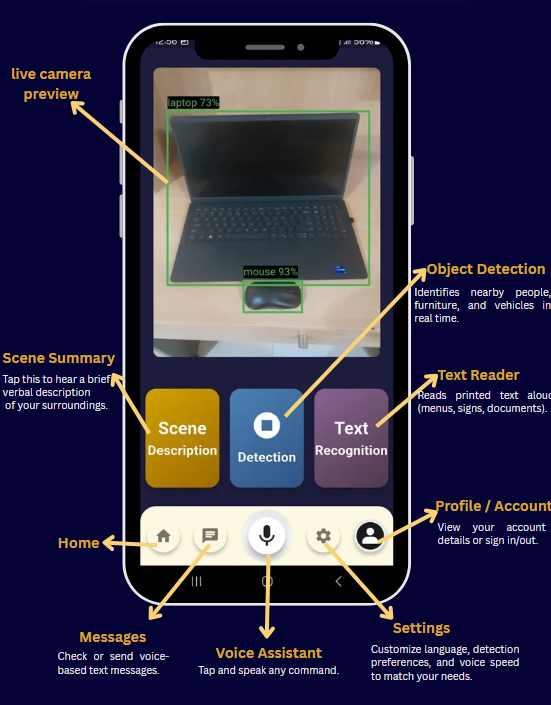
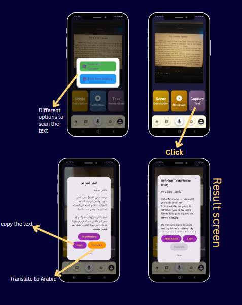
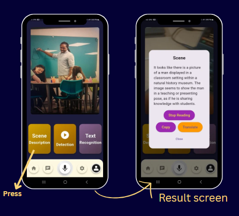
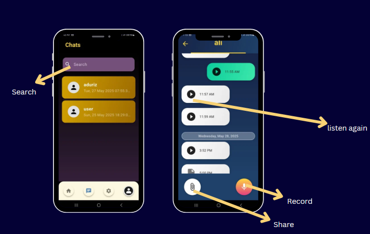
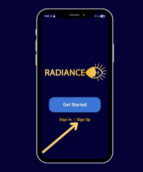
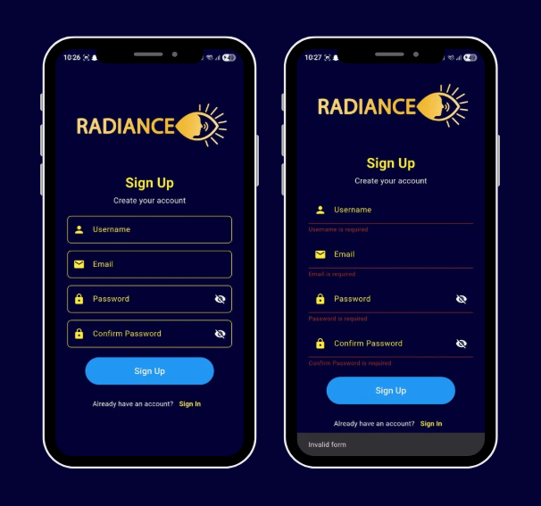
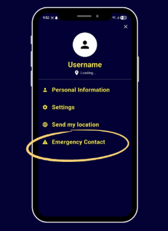
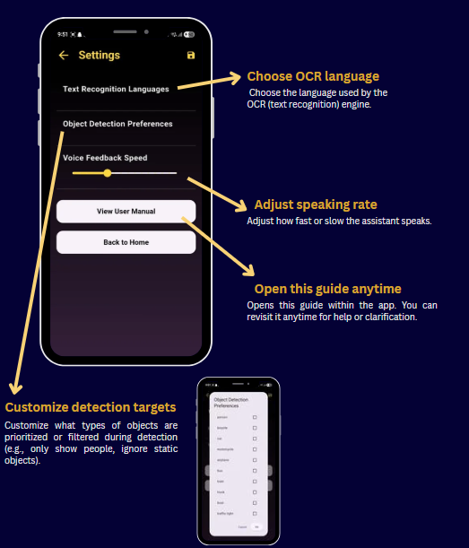

<p align="center">
    
</p>

# Radiance: Intelligent Assistive Technology Platform

**Built by Adonay, Sedra Wattar and Sara Walhan**

> *Where cutting-edge AI meets accessibility engineering*

[](https://flutter.dev)
[](https://python.org)
[](LICENSE)

[](https://ieee.org)

Radiance is a **multimodal AI-powered assistive technology platform** that leverages real-time computer vision, natural language processing, and edge computing to provide comprehensive environmental awareness for visually impaired users.

## 🎓 Key User Features

- **Object Detection:** Identify hazards in real time using the camera.
- **Text Recognition:** Scan and read printed or digital text via OCR.
- **Scene Analysis:** Gain awareness of the surrounding environment.
- **Voice Communication:** Accessibly, Send and receive voice messages with friends and families.
- **Emergency Features:** Access safety protocols and alerts.
- **Agentic System:** Control the entire app through an intelligent agent, enabling hands-free operation for users who find screen navigation challenging. **The agent can autonomously call tools for object detection, text recognition, scene analysis, as well as provide ***directions*** and location awareness**.

## 🏗️ Architecture Deep Dive

This repo follows a **microservices-oriented architecture** with clear separation of concerns:

```
root/
├── 📱 projects/              # Flutter mobile application (client-side)
│   ├── lib/                  # Dart application logic
│   ├── assets/               # ML models, audio assets, tessdata
│   └── android/ios/linux/    # Platform-specific builds
├── 🔧 sep_backend/           # Python Flask API server (backend services)
├── 🛠️  build/                # CMake build artifacts
└── 📋 LICENSE               # Apache 2.0 licensing
```

### 🧠 Core Technology Stack

**Frontend (Mobile)**
- **Flutter 3.7.2+** - Cross-platform UI framework
- **TensorFlow Lite** - On-device ML inference
- **Camera & Permissions** - Real-time video capture
- **Speech-to-Text/TTS** - Voice interaction pipeline
- **Firebase** - Authentication & cloud services

**Backend (API Layer)**
- **Flask** - Lightweight WSGI web framework
- **OpenCV** - Computer vision processing
- **PyTorch/ONNX** - Deep learning model serving
- **Tesseract OCR** - Optical character recognition
- **PostgreSQL** - Persistent data storage

**ML/AI Models**
- **YOLO v11** variants (FP16/FP32/INT8 quantized)
- **ResNet-18 Places365** - Scene classification
- **Tesseract** - Multi-language OCR engine
- **Custom voice synthesis** - Audio feedback system

## 🎯 Feature Matrix

| Feature | Technology | Purpose |
|---------|------------|---------|
| 🔍 **Real-time Object Detection** | YOLO v11 + TFLite | Hazard identification & navigation assistance |
| 📝 **Text Recognition** | Tesseract OCR | Sign reading, document scanning |
| 🌄 **Scene Description** | ResNet-18 Places365 | Environmental context awareness |
| 🤖 **Agentic AI System** | LangGraph + OpenAI | Hands-free app control & tool orchestration |
| 💬 **Voice Messaging** | Speech-to-Text + Flask API | Communication platform |
| 🚨 **Emergency System** | GPS + Real-time alerts | Safety & emergency response |
| ⚙️ **Adaptive Settings** | Local preferences | Personalized user experience |

## 📱 Android Frontend Setup & Deployment

<div align="center">




</div>

### Quick Start
```bash
# Navigate to the Flutter project
cd projects/

# Install dependencies
flutter pub get

# Run on connected device/emulator
flutter run

```

### Asset Pipeline
The app utilizes several **pre-trained models** and assets:
- `assets/yolo11n*.tflite` - Object detection models (various quantization levels)
- `assets/tessdata/` - Tesseract language packs
- `assets/audio/` - System sounds and TTS audio
- `assets/images/` - UI assets and tutorial screenshots

## � Visual User Manual

### Getting Started
<div align="center">
<table>
<tr>
<td align="center">
<br/>
<b>🔐 Sign Up Process</b><br/>
Create your secure account
</td>
<td align="center">
<br/>
<b>📝 Account Details</b><br/>
Fill in your information
</td>
</tr>
</table>
</div>

### Core Features
<div align="center">
<table>
<tr>
<td align="center">
<br/>
<b>🔍 Object Detection</b><br/>
Real-time hazard identification
</td>
<td align="center">
<br/>
<b>📝 Text Recognition</b><br/>
OCR for signs and documents
</td>
</tr>
<tr>
<td align="center">
<br/>
<b>🌄 Scene Analysis</b><br/>
Environmental awareness
</td>
<td align="center">
<br/>
<b>💬 Voice Messaging</b><br/>
Communication platform
</td>
</tr>
</table>
</div>

### Safety & Settings
<div align="center">
<table>
<tr>
<td align="center">
<br/>
<b>🚨 Emergency Features</b><br/>
Safety protocols & alerts
</td>
<td align="center">
<br/>
<b>⚙️ Settings</b><br/>
Customize your experience
</td>
</tr>
</table>
</div>

## �🔧 Backend Architecture

The backend is a **Python-based microservices architecture** located in `/sep_backend/`. 

**👉 For detailed backend setup, configuration, and API documentation, navigate to:**
```bash
cd sep_backend/

```

Key backend components include:
- **Flask API server** (`app.py`) - Main application entry point
- **Computer vision pipeline** (`scenedescription.py`, `ocr.py`)
- **Voice processing** (`voice_chat.py`, `chat_utils.py`)
- **Database layer** (`postgres_utils.py`)
- **Geolocation services** (`directions.py`)


## 🛡️ Security & Privacy

- **Local-first processing** - Sensitive data processed on-device when possible
- **Encrypted communication** - All API calls use HTTPS/TLS
- **Permission management** - Granular control over camera, microphone, location
- **Data minimization** - Only necessary data transmitted to backend

## 🚀 Performance Optimizations

- **Model quantization** - INT8/FP16 variants for mobile efficiency
- **Edge computing** - On-device inference reduces latency
- **Async processing** - Non-blocking UI with background tasks
- **Caching strategies** - Local storage for frequently accessed data

## 📜 License & Legal

This project is licensed under the **Apache License 2.0** - see the [LICENSE](LICENSE) file for full details.


---


